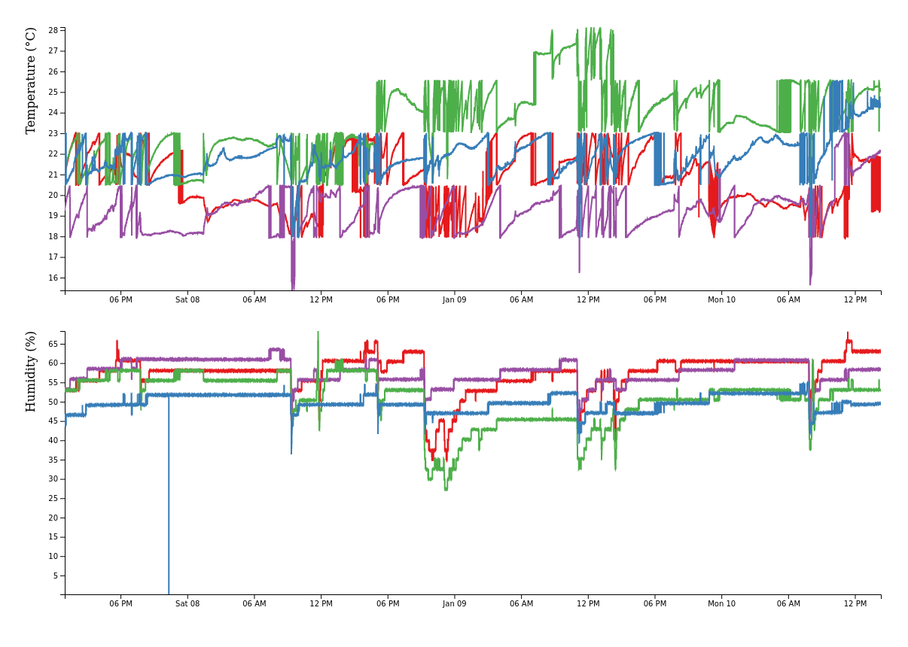

# BLE Monitor

Python package to monitor Bluetooth Low Energy advertisements and store the data in a PostgreSQL database. The tool was developed to capture temperature and humidity measurements from Xiaomi Mijia devices with [custom firmware](https://github.com/atc1441/ATC_MiThermometer) but is configurable to work with other devices. The monitor captures all the transmitted service data and only needs to know about MAC addresses and service UUIDs.

## Install

Make sure you have PostgreSQL installed and running. Create a new user and database. Check out `script/create_db.sql` for an example.

Follow [this guide](https://pygobject.readthedocs.io/en/latest/getting_started.html#ubuntu-getting-started) to install the build dependencies for PyGObject.

Create a fresh Python 3.8+ environment, e.g. with

```
python -m venv ble
source ble/bin/activate
```

Install the requirements and the `ble_monitor` package with

```
pip install -r requirements.txt
pip install .  # Use -e if you plan to make changes
```

The `PGUSER`, `PGPASSWORD`, `PGHOST`, `PGPORT`, `PGDATABASE` environment variables need to be set to access you newly created database. See `script/set_env_vars.sh` for an example.

## Configure

Create a configuration file similar to `config/ATC_V35a.yaml`. If you are planning to capture advertisements from a Xiaomi Mijia Thermometer with [custom firmware](https://github.com/atc1441/ATC_MiThermometer), you will likely only need to adjust the list of remote devices. Otherwise, you will at least want to change the service UUIDs and the data mask (leave blank if you do not care about masking your data). Run a bluetooth scan with the following commands to get some of the required information:

```
$ bluetoothctl
[bluetooth] menu scan
[bluetooth] clear  # this should clear filters for BLE devices
[bluetooth] back
[bluetooth] scan on
```

Run the following line to set up the database

```
python3 scripts/run.py -c <path to config file> create
```

## Start

Start data collection with

```
python3 scripts/run.py -c <path to config file>
```

## View

You can use the simple API and frontend in `viewer` to display your data. The frontend is geared towards temperature and humidity measurements from Xiaomi Mijia devices so you will have to adjust the data extraction if you work with other devices.

You need to have `node` and `yarn` installed. Navigate to `viewer/api` and install the dependencies for the API with `yarn install` and start the api with `node api.js`. Start the frontend with `npx http-server viewer/frontend` or your server of choice.



## Remote data collection

You may want to collect data on a remote device (like a Raspberry Pi, etc.). Make sure you allow remote connections to the database on this device by adding the following line to `/etc/postgresql/<version>/main/pg_hba.conf` (run `show hba_file` in `psql` if you cannot locate the correct file):

```
host    all             all             0.0.0.0/0               md5
```

Furthermore, adjust the respective line in `/etc/postgresql/<version>/main/postgresql.conf` to read

```
listen_addresses = '*'
```
